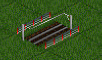
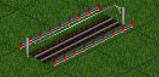
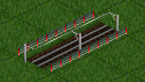
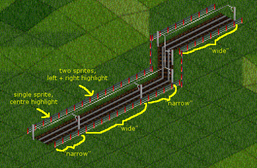
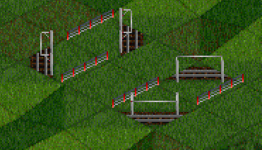
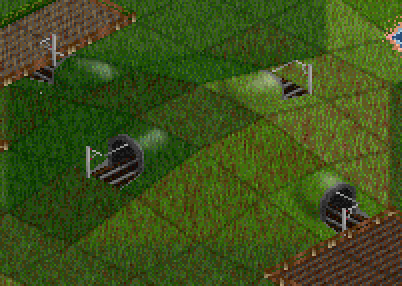
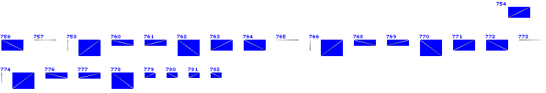
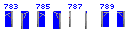

# A short discussion of catenary in OpenTTD

There's not a huge amount of information on how catenary in NewGRFs works, so here's an attempt
to explain what's going on based on some reverse-engineering and experimentation.

If you've looked at the NML or NewGRF documentation you've probably run across something like:

"Catenary wire (28 sprites) - Follows the same layout for wires of the first 28 sprites as Action5 type 5."

If you're like me, your first thought was, "**28** sprites? How is that supposed to work?"

## Wide and narrow catenary

Time for something subtle.

Here is a single tile of electric rail (with catenary) in OpenTTD:

Here are two tiles of electric rail:

This is also two tiles of electric rail:

Although there's only one rail sprite for the diagonal track, three types of catenary sprite are in play,
as shown here:

This applies for each of the available track directions, including hills. Totalling those up we get:

* Diagonal tracks: 2 track sprites * 3 catenary sprites = 6 catenary sprites
* Hills: 4 track sprites * 3 catenary sprites = 12 catenary sprites

(18 total)

Vertical and horizontal tracks re-use the same catenary sprites, with the game handling the offsets of the
single tiles:

This gives 2*3 sprites, leaving 4 remaining.

The final 4 catenary sprites are for tunnels, thus:

## Wire sprites

The order of the 28 wire sprites is:

* 1-4: single tile, flat track
* 5-8: single tile, hills
* 9-12: 2-tile part A, flat track
* 13-16: 2-tile part A, hills
* 17-20: 2-tile part B, flat track
* 21-24: 2-tile part B, hills
* 25-28: tunnels

Which in the original bundled graphics gives something like this:

## Pylons

Catenary pylons are much simpler than the wire layouts. Each direction has a "front" and "back"
pylon to hold the wires:

For the 4 track directions this gives a standard OpenTTD 8-sprite layout, which in the original
graphics looks like this:

